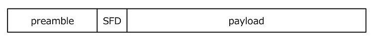

# 無線通信のパケットフォーマット

USRPなどのソフトウェア無線機で捕まえた電波を解析するときに必要な知識です。

## 全体像

無線通信のパケットは、ほとんどのものは
+ preamble
+ start frame delimiter
+ payload

の3つから構成されます。

## preamble

プリアンブルは送信側と受信側で共有されている既知の信号です。
ゲインのコントロール、周波数誤差の推定、シンボルタイミング同期など無線で通信するためのいろいろな微調整を行うために使用されています。
多くのシステムでは`10101010101010`みたいな繰り返し信号を使っています。
無線LANとかだと若干複雑な信号を送っています。

##  start frame delimiter

プリアンブルの終了とペイロードの開始を検出するために入っている送信側と受信側で共有されている信号です。
SoF (start of frame)とかstart codeとかいろんな名前で呼ばれてます。
1バイトか2バイトのランダムっぽい値のことが多いです。

## payload

ここの部分に物理層のヘッダ、MAC層のヘッダ、IP層のヘッダとかデータ本体とかが入っています。
